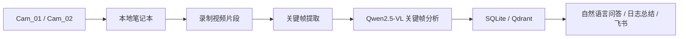
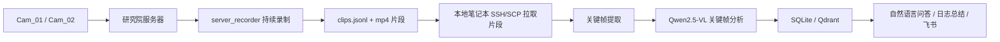

# 智能视频监控 Agent 系统

这是一个面向安防场景的云边协同视频分析项目，核心能力包括：

- 两路摄像头视频采集与片段录制
- 关键帧提取与事件合并
- 基于视觉大模型的关键帧分析
- 高危事件飞书告警
- 基于 SQLite + Qdrant 的检索与 RAG 问答
- 自然语言监控对话
- 全天日志 AI 总结

当前项目已经支持两种运行模式：

- `本地直连模式`
  适合人在研究院、笔记本可以直接访问摄像头内网 RTSP 的场景
- `远程录制模式`
  适合人不在研究院、本地无法直接访问摄像头，但可以通过 SSH/Tailscale 访问服务器的场景

## 1. 当前架构

### 1.1 本地直连模式



### 1.2 远程录制模式



这两个模式共用同一套前端、问答、总结、告警和数据库逻辑，区别只在“视频片段从哪里来”。

## 2. 核心模型与组件

### 2.1 图像模型

- 图像模型：`Qwen2.5-VL`
- 调用方式：OpenAI 兼容接口
- 当前配置入口：
  - [camera_config.json](C:\Users\chens\Desktop\camera_project\camera_config.json)
  - [camera_config.local.json](C:\Users\chens\Desktop\camera_project\camera_config.local.json)
  - [camera_config.remote.json](C:\Users\chens\Desktop\camera_project\camera_config.remote.json)

### 2.2 文本模型

- 本地文本模型：`qwen2.5:latest`
- 运行方式：`Ollama`
- 负责：
  - 自然语言监控对话
  - 日志总结润色
  - RAG 回答生成

### 2.3 向量检索

- Embedding 服务：本地 `api_server.py`
- 向量库：`Qdrant`
- 结构化库：`SQLite`

## 3. 项目目录

```text
camera_project/
├─ app.py                         Flask Web 服务入口
├─ monitoring_service.py          主编排器，负责双模式切换
├─ monitoring_analysis.py         关键帧分析工作流
├─ monitoring_query.py            自然语言问答工作流
├─ monitoring_summary.py          日志总结工作流
├─ monitoring_prompts.py          提示词模板
├─ monitoring_types.py            TypedDict 状态定义
├─ camera_recorder.py             本地直连 RTSP 录制与预览
├─ remote_capture_client.py       远程模式下的 SSH/SCP 片段拉取
├─ smart_extractor.py             关键帧提取与事件合并
├─ llm_client.py                  图像模型客户端
├─ ollama_client.py               本地文本模型客户端
├─ embedding_client.py            Embedding 客户端
├─ vector_store.py                Qdrant 客户端
├─ event_store.py                 SQLite 存储
├─ feishu_agent.py                飞书告警与日报推送
├─ schemas.py                     配置结构定义
├─ camera_config.json             默认配置，当前等同于本地直连版
├─ camera_config.local.json       本地直连版配置
├─ camera_config.remote.json      远程录制版配置
├─ run_local.ps1                  本地直连版启动脚本
├─ run_remote.ps1                 远程录制版启动脚本
├─ prompt.txt                     图像分析提示词
├─ templates/index.html           前端页面
├─ static/js/script.js            前端交互逻辑
├─ static/css/style.css           前端样式
└─ server_capture_gateway/        服务器录制端代码
```

## 4. 两种运行模式怎么选

### 4.1 本地直连模式

适用场景：

- 你人在研究院
- 笔记本与摄像头在同一个局域网
- 本地能直接访问 RTSP

配置文件：

- [camera_config.local.json](C:\Users\chens\Desktop\camera_project\camera_config.local.json)

启动命令：

```powershell
.\run_local.ps1
```

或：

```powershell
$env:CAMERA_CONFIG_PATH = "camera_config.local.json"
python app.py
```

特点：

- 支持网页中的实时画面接入
- 本地直接录制 RTSP
- 不依赖服务器片段清单

### 4.2 远程录制模式

适用场景：

- 你不在研究院
- 本地无法直接访问摄像头 RTSP
- 研究院服务器可以访问摄像头
- 你本地可以通过 `SSH/Tailscale` 访问服务器

配置文件：

- [camera_config.remote.json](C:\Users\chens\Desktop\camera_project\camera_config.remote.json)

启动命令：

```powershell
.\run_remote.ps1
```

或：

```powershell
$env:CAMERA_CONFIG_PATH = "camera_config.remote.json"
python app.py
```

特点：

- 当前不提供真正的实时视频预览
- 本地会从服务器读取 `clips.jsonl`
- 本地通过 `scp` 拉取最新视频片段后继续分析

## 5. 远程录制模式的前提

远程模式要成立，需要先满足下面几个条件：

1. 研究院服务器已经启动录制端
2. 服务器持续生成 `clips.jsonl`
3. 你的本地可以无交互执行 `ssh` 和 `scp`
4. 服务器录制目录与 manifest 路径与配置一致

当前远程模式使用的关键配置：

- `ssh_host`
- `ssh_port`
- `ssh_username`
- `remote_manifest_path`
- `local_cache_dir`
- `processed_state_path`
- `max_clips_per_camera`

这些字段都在 [camera_config.remote.json](C:\Users\chens\Desktop\camera_project\camera_config.remote.json) 的 `capture` 段里。

## 6. 服务器录制端

服务器录制端代码在：

- [server_capture_gateway](C:\Users\chens\Desktop\camera_project\server_capture_gateway)

部署到服务器后，职责只有：

- 连接两路 RTSP
- 按固定时长滚动录制 mp4
- 写入 `clips.jsonl`
- 清理过期原始视频

### 6.1 服务器录制时长在哪里设置

真正控制“服务器每段录多久”的字段不是本地项目配置，而是服务器端的：

- `segment_seconds`

位置：

- [server_config.example.json](C:\Users\chens\Desktop\camera_project\server_capture_gateway\server_config.example.json)

例如：

```json
"segment_seconds": 120
```

表示服务器每段录制 120 秒。

### 6.2 视频保留时长在哪里设置

服务器端配置字段：

- `retention_days`

例如：

```json
"retention_days": 7
```

表示服务器保留 7 天原始片段。

## 7. 本地服务依赖

本地建议至少运行以下服务：

### 7.1 Web 主程序

```powershell
python app.py
```

访问：

```text
http://127.0.0.1:5000
```

### 7.2 Embedding 服务

```powershell
.\.embed-gpu\Scripts\python.exe api_server.py
```

健康检查：

```powershell
curl.exe http://127.0.0.1:8080/health
```

### 7.3 Qdrant

```powershell
curl.exe http://127.0.0.1:6333/collections
```

### 7.4 Ollama

确认 `qwen2.5:latest` 已就绪：

```powershell
ollama ps
ollama list
```

## 8. 数据存储位置

当前默认存储路径在：

- `D:\camera_agent_data`

主要内容包括：

- `security_events.db`
  - SQLite 结构化事件数据
- `remote_clips\...`
  - 远程模式下从服务器下载的 mp4 片段
- `<task_id>\raw_clips\...`
  - 本地直连模式下录制的原始片段
- `<task_id>\analysis\<camera_id>\...`
  - 抽取出的关键帧与分析中间文件

Qdrant 独立数据目录通常为：

- `D:\qdrant.data`

## 9. 主要接口

### 页面与视频

- `GET /`
- `GET /video_feed/<camera_id>`

### 状态与任务

- `GET /api/overview`
- `GET /api/cameras`
- `GET /api/status`
- `GET /api/logs`
- `POST /api/tasks/start`

### 事件与总结

- `GET /api/events?date=YYYY-MM-DD`
- `GET /api/summaries?date=YYYY-MM-DD`
- `GET /api/summaries/latest`
- `POST /api/reports/daily`

### 自然语言对话

- `POST /api/chat`
- `POST /api/chat/stream`

## 10. 当前已完成的能力

- 白色中文化 Web 界面
- 四个主页面：
  - 实时监控画面
  - 关键帧分析
  - 自然语言对话
  - 全天日志总结
- 对话侧边栏会话记录
- 对话流式输出
- 本地文本模型问答
- Qwen2.5-VL 关键帧分析
- 高危事件飞书推送
- 每日总结生成
- 双模式部署

## 11. 当前限制

### 11.1 远程录制模式暂无实时画面

远程模式目前只支持：

- 服务器录制
- 本地拉片
- 本地分析

还不支持：

- 真正的远程实时视频预览

如果后续需要，可以增加：

1. 服务器定时快照预览
2. 服务器代理 MJPEG / WebRTC 预览

### 11.2 远程模式依赖 SSH/SCP

本地必须能执行：

- `ssh jxq@100.106.1.46`
- `scp ...`

更推荐提前配置 SSH key，避免密码交互阻塞任务。

## 12. 推荐使用方式

### 场景 A：人在研究院

- 启动本地直连版
- 直接使用 [camera_config.local.json](C:\Users\chens\Desktop\camera_project\camera_config.local.json)
- 可以看实时画面

### 场景 B：不在研究院

- 先保证服务器录制端持续运行
- 启动远程录制版
- 使用 [camera_config.remote.json](C:\Users\chens\Desktop\camera_project\camera_config.remote.json)
- 本地继续承担关键帧分析、问答、总结和告警

## 13. 一句话总结

这个项目现在已经不是单一部署形态，而是：

- 在研究院内网时，用“本地直连版”
- 不在研究院时，用“服务器录制 + 本地分析版”

两者共用同一套前端、数据库、问答、总结和飞书告警逻辑，只切换采集来源。
